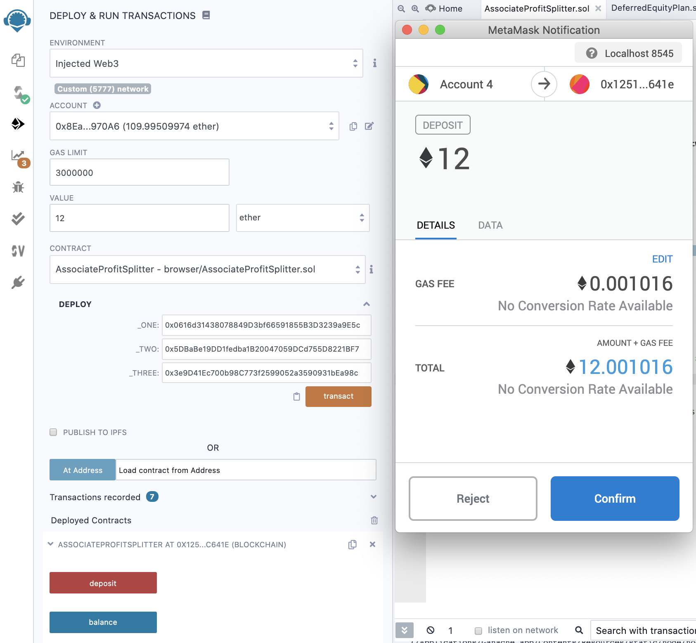

# **Roulette or Carosel?**
## Join us today! Get paid by **"Remixed"** blockchain smart contract _xoxo_
### _**Are we rewarded based on merits at work?**_

**Story**: Our company is recently founded with three members. We are creating ethereum smart contract to democratize payment system, increase transparency and automate tax filing procedures. 

_**Profits are distributed following a "trilogy" schedule as described below:**_

> Level 1: equally among employees
> 
> Level 2: based on tiers 
> 
> Level 3: how long members hanging with us 

---
**Kovan Transaction for Level-One Contract: _EQUAL SPLIT_**


_Note: CEO, CTO and Bob each get a third of 0.1 ETH, in other words, 0.0333 ETH based on the contract._

<details><summary>
See Tiered Transaction on Kovan of 0.3 ETH from HR (click me)
</summary>


</details>

_**[Kovan Transaction Records](Contracts/Records/Kovan)**_


**Ropsten Transaction for Level-Two Contract: _Tiered Distribution_**


_Note: CEO gets 60% of 0.15 ETH, i.e. 0.09 ETH; CTO gets 25% of 0.15 ETH, thus 0.0375 ETH; and Bob gets 15% of 0.15 ETH, or 0.0225 ETH._


<details><summary>
See Equal-Split Transaction on Ropsten of 0.03 ETH from HR (click me)
</summary>


</details>

_**[Ropsten Transaction Records](Contracts/Records/Ropsten)**_

---


**Initial Balances on Ganache**


<details><summary>
Human Resources Account Address
</summary>

```
HR: 0x8EaaBB9Fc753df2C50F0b01E99b4e0F1f2d970A6
```
</details>

<details><summary>
Account Addresses for Members
</summary>

```
CEO: 0x0616d31438078849D3bf66591855B3D3239a9E5c

CTO: 0x5DBaBe19DD1fedba1B20047059DCd755D8221BF7

Bob: 0x3e9D41Ec700b98C773f2599052a3590931bEa98c
```

</details>


_Lauch Ganache on [Localhost: 8545](HTTP://127.0.0.1:8545)_

_**Balances View on [Ganache](https://www.trufflesuite.com/ganache)**_


_Note: Three member addresses (the first three) followed by HR address (the fourth)._


---
## **TYPES OF CONTRACTS**

---
**Level-One: EQUAL SPLIT**

_**Goal**: Distribute profits evenly among members._

```
AssociateProfitSplitter
```

_**Step 1: Deploy**_
* A green check mark should appear should the process be successful

_**Step 2: Compile**_
* Choose `Injected Web3` for _ENVIRONMENT_
  * Route to local network as Ganache
* Keep 0 for _VALUE_ 
* Enter the three member addresses

* Confirm on _**MetaMask**_ Notification
  * Make sure _MetaMask_ is hooked onto Localhost 8545


_**Step 3: Deposit**_

* Change the _VALUE_ to 12 ether

* Click on the red `deposit` button under _Deployed Contracts_ and confirm _MetaMask_ notification


_**View Transactions: Relaunch Ganache**_
  * Balance on each of the three accounts increased by approximately 4 ether, which is provided by 12 ETH divided by 3 
  * HR Account, fourth from the top, has its balance dropped by approximately 12 ETH 
      * adjusted by gas fees


---
**Level-Two: RANK-BASED SHARING**

_**There is always another door! Let's climb. Shall we?**_

_**Goal**: Distribute profits to different tiers of employees._

```
TieredProfitSplitter
```

_**Step 1: Deploy**_
* A green check mark accompanies a successful deployment

  * Confirmation on _Remix_


_**Step 2: Compile**_
* Choose `Injected Web3` for _ENVIRONMENT_
  * Route to local network as Ganache
* Keep 0 for _VALUE_ 
* Enter the three member addresses

* Confirm on _**MetaMask**_ Notification
  * Make sure _MetaMask_ is hooked onto Localhost 8545


_**Step 3: Deposit**_

* Ganache View pre-distribution
  * A drop of 0.01 ETH from prior balance of 97.99 ETH for HR Account due to gas fee on deployment


* Change the _VALUE_ to 10 ether, click on the `deposit` button under the second _Deployed Contracts_ for tiered distribution schedule and confirm the notification on _MetaMask_ 


_**View Tiered Distributions: Relaunch Ganache**_
  * Based on the 60-25-15 plus remainder schedule, balances on the three accounts increased by approximately 
    * CEO: 60% * 10 = 6 ETH
      * from 128.42 to 134.42 ether
    * CTO: 25% * 10 = 2.5 ETH
      * from 130.66 to 133.16 ether
    * Bob: 15% * 10 = 1.5 ETH
      * from 65.63 to 67.13 ether

  * HR Account, fourth from the top, has its balance dropped by 10 ether
    * from 74.86 to 64.85 ether


---

**Level-Three: VESTED SHARES** 

_**THANK YOU for Hanging with Us!**_

_**Goal**: Distribute company shares for employees in a "deferred equity incentive plan" automatically._
```
DeferredEquityPlan
```
_**Deploy and Compile!**_


_For a 100-day fastforward test contract: **fakenow** variable and **fastforward** function are created._

```solidity
   /* @TODO: Test contract via fakenow variable
    uint fakenow = now;
    
       @TODO: Add this function to "fast forward" time by 100 days
    function fastforward() public {
    fakenow += 100 days;
}
*/
```
_**View Functions: Relaunch Ganache**_

_The balance on HR Account decreased by 0.01 ether for gas fee on deployment._


### **Next Steps**

To view transactions on 
[Kovan EtherScan](https://etherscan.io/)

_Switch _MetaMask_ from Localhost 8545 to Kovan and Ropsten Test Network_


_**Option 1: Kovan or Ropsten Testnet**_

_See screenshots at the beginning for confirmations_

Need to fund HR account at the following address
```
HR: 0x8EaaBB9Fc753df2C50F0b01E99b4e0F1f2d970A6
```

<details><summary>
Sample testcoin funding on Kovan
</summary>


</details>

Then, follow the same process as on `localhost:8545` to distribute to three different addresses for CEO, CTO and Bob.

_**Option 2 Coming up: Customized Ethereum Testnet**_

Again, need to run nodes to fund crypto account by connecting to customized network on MyCrypto Wallet. 

---

## Files

* [Level-One: Equal-Split](Contracts/Code/AssociateProfitSplitter.sol) 

* [Level-Two: Rank-based Sharing](Contracts/Code/TieredProfitSplitter.sol) 

* [Level-Three: Vested Shares](Contracts/Code/DeferredEquityPlan.sol) 

* [Kovan Transactions](Contracts/Records/Kovan) 

* [Ropsten Transactions](Contracts/Records/Ropsten)

---
# References
* Columbia University Fintech Gitlab Repository
* http://remix.ethereum.org/
* https://www.trufflesuite.com/ganache
* https://mycrypto.com/
* https://metamask.io/


